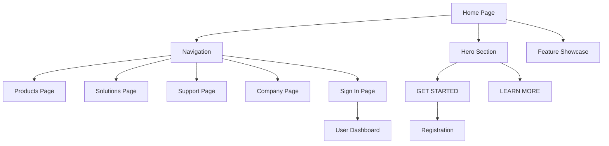

## 1. Product Overview
A modern finance website built with Next.js that provides financial services and solutions. The platform focuses on helping users manage their finances, taxes, and business operations with a clean, professional interface that emphasizes trust and expertise.

Target audience includes individuals and businesses seeking reliable financial services, tax assistance, and business growth solutions.

## 2. Core Features

### 2.1 User Roles
| Role | Registration Method | Core Permissions |
|------|---------------------|------------------|
| Visitor | No registration required | Browse website content, view features, access informational pages |
| Registered User | Email registration | Access personalized features, manage account, view dashboard |
| Premium User | Subscription upgrade | Full access to advanced financial tools, priority support, detailed analytics |

### 2.2 Feature Module
The finance website consists of the following main pages:
1. **Home page**: Navigation bar, hero section with call-to-action, three-column feature showcase.
2. **Products page**: Detailed service offerings and financial tools.
3. **Solutions page**: Business and personal finance solutions.
4. **Support page**: Help resources, blogs, and customer support.
5. **Company page**: About us, team, and company information.
6. **Sign in page**: User authentication and account access.

### 2.3 Page Details
| Page Name | Module Name | Feature description |
|-----------|-------------|---------------------|
| Home page | Navigation bar | Display brand logo, menu items (Products, Solutions, Support and Blogs, Company), language selector (EN-US), sign in button, theme toggle. |
| Home page | Hero section | Show full-width background image with overlay text, display headline "We do the hard work. You enjoy the rewards.", show subtext "Focus on what matters. We'll handle what's due.", provide GET STARTED and LEARN MORE buttons. |
| Home page | Feature showcase | Three-column layout with feature cards, display tax services, financial progress, business operations, and business growth cards, include icons and descriptions for each feature. |
| Products page | Service catalog | List all financial products and services, provide detailed descriptions and pricing information, include call-to-action buttons for each product. |
| Solutions page | Solution categories | Organize solutions by personal and business needs, provide case studies and success stories, include consultation booking options. |
| Support page | Help resources | Display blog articles and guides, provide search functionality for help content, include contact information and support ticket system. |
| Company page | Company information | Show company history and mission, display team member profiles, include career opportunities and press information. |
| Sign in page | Authentication form | Provide email and password login fields, include forgot password link, offer social media login options, validate user credentials. |

## 3. Core Process
### Visitor Flow
1. User lands on homepage with navigation and hero section
2. User can explore features in the three-column showcase
3. User can navigate to Products, Solutions, Support, or Company pages
4. User can click GET STARTED to begin registration process
5. User can sign in to access account features

### Registered User Flow
1. User signs in to access personalized dashboard
2. User can access premium features and tools
3. User can manage financial data and view reports
4. User can upgrade to premium subscription

## 4. User Interface Design

### 4.1 Design Style
- **Primary colors**: White background, dark navy/gray text (#1a1a1a), pink/red accent (#ff3366)
- **Secondary colors**: Green status indicators (#00cc66), pale yellow highlights (#fff3cd), blue text highlights (#0066cc)
- **Button style**: Rounded corners with subtle shadows, primary buttons use pink/red background, secondary buttons use dark gray with outline
- **Typography**: Serif fonts for headlines (Playfair Display or similar), sans-serif for body text and navigation (Inter or similar)
- **Layout style**: Card-based design with subtle shadows, fixed top navigation, full-width hero section
- **Icons**: Minimalist line icons with consistent stroke weight, circular backgrounds for feature icons

### 4.2 Page Design Overview
| Page Name | Module Name | UI Elements |
|-----------|-------------|-------------|
| Home page | Navigation bar | Fixed position at top, white background with subtle shadow, brand logo "FINANCE" in bold white text with pink circular icon, horizontal menu with dropdown indicators, right-aligned controls including language selector with globe icon, sign in button, and theme toggle moon icon. |
| Home page | Hero section | Full-width background image with indoor workspace scene, dark overlay for text contrast, left-aligned content container, large serif headline in white text spanning two lines, smaller sans-serif subtext, two rounded buttons with arrow icon on primary button, responsive positioning for all screen sizes. |
| Home page | Feature showcase | Three-column grid layout on desktop, stacked on mobile, left column contains four feature cards with white background and subtle shadows, each card includes circular icon with different colors, center column features large image with desk scene and yellow vertical accent band, right column shows promotional content with Mailchimp branding and blue highlighted text. |

### 4.3 Responsiveness
- **Desktop-first approach**: Design optimized for 1920px width, progressively enhanced for larger screens
- **Mobile adaptation**: Responsive breakpoints at 768px and 480px, navigation converts to hamburger menu
- **Touch interaction**: Larger tap targets on mobile, swipe-enabled carousels where applicable
- **Flexible grid**: Three-column layout stacks to single column on mobile devices

### 4.4 Accessibility
- High contrast ratios for text readability (minimum 4.5:1)
- Keyboard navigation support for all interactive elements
- Screen reader compatible with proper ARIA labels
- Focus indicators for interactive elements
- Alt text for all images and icons