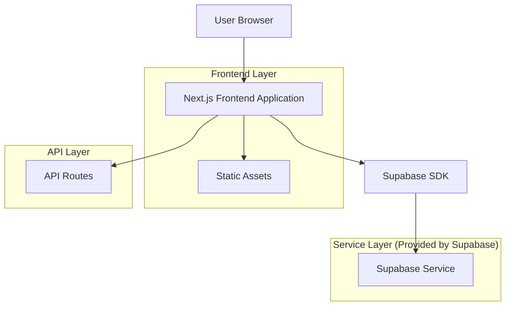
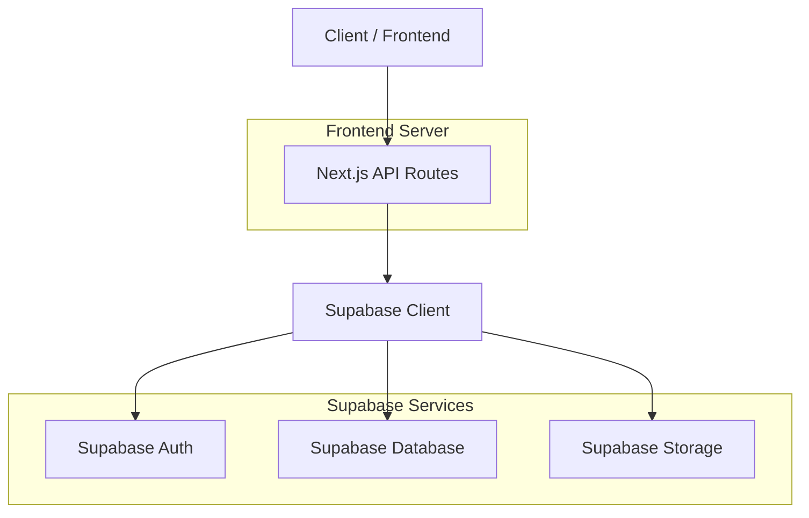
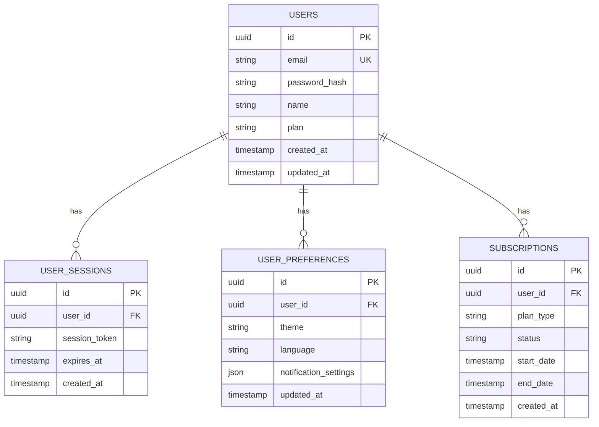

## 1. Architecture design



## 2. Technology Description
- **Frontend**: Next.js@14 + React@18 + TypeScript + TailwindCSS@3
- **Initialization Tool**: create-next-app
- **Backend**: Supabase (Authentication, Database, Storage)
- **Styling**: TailwindCSS with custom design tokens
- **Icons**: Lucide React or Heroicons
- **Deployment**: Vercel (recommended for Next.js)

## 3. Route definitions
| Route | Purpose |
|-------|---------|
| / | Home page with navigation, hero section, and feature showcase |
| /products | Products and services catalog page |
| /solutions | Business and personal finance solutions page |
| /support | Help resources and blog articles page |
| /company | Company information and about page |
| /auth/signin | User authentication and sign in page |
| /auth/signup | User registration page |
| /dashboard | User dashboard (protected route) |
| /api/auth/* | Authentication API endpoints |
| /api/user/* | User management API endpoints |

## 4. API definitions

### 4.1 Authentication API
```
POST /api/auth/signin
```

Request:
| Param Name| Param Type  | isRequired  | Description |
|-----------|-------------|-------------|-------------|
| email     | string      | true        | User email address |
| password  | string      | true        | User password |

Response:
| Param Name| Param Type  | Description |
|-----------|-------------|-------------|
| user      | object      | User data object |
| session   | object      | Authentication session |

Example
```json
{
  "email": "user@example.com",
  "password": "securepassword123"
}
```

### 4.2 User Management API
```
GET /api/user/profile
```

Response:
| Param Name| Param Type  | Description |
|-----------|-------------|-------------|
| id        | string      | User unique identifier |
| email     | string      | User email address |
| name      | string      | User full name |
| plan      | string      | User subscription plan |
| created_at| timestamp   | Account creation date |

## 5. Server architecture diagram


## 6. Data model

### 6.1 Data model definition


### 6.2 Data Definition Language
User Table (users)
```sql
-- create table
CREATE TABLE users (
    id UUID PRIMARY KEY DEFAULT gen_random_uuid(),
    email VARCHAR(255) UNIQUE NOT NULL,
    password_hash VARCHAR(255) NOT NULL,
    name VARCHAR(100) NOT NULL,
    plan VARCHAR(20) DEFAULT 'free' CHECK (plan IN ('free', 'premium', 'enterprise')),
    created_at TIMESTAMP WITH TIME ZONE DEFAULT NOW(),
    updated_at TIMESTAMP WITH TIME ZONE DEFAULT NOW()
);

-- create indexes
CREATE INDEX idx_users_email ON users(email);
CREATE INDEX idx_users_plan ON users(plan);

-- set up Row Level Security (RLS)
ALTER TABLE users ENABLE ROW LEVEL SECURITY;

-- create policies
CREATE POLICY "Users can view their own data" ON users
    FOR SELECT USING (auth.uid() = id);

CREATE POLICY "Users can update their own data" ON users
    FOR UPDATE USING (auth.uid() = id);
```

User Sessions Table (user_sessions)
```sql
-- create table
CREATE TABLE user_sessions (
    id UUID PRIMARY KEY DEFAULT gen_random_uuid(),
    user_id UUID REFERENCES users(id) ON DELETE CASCADE,
    session_token VARCHAR(255) NOT NULL,
    expires_at TIMESTAMP WITH TIME ZONE NOT NULL,
    created_at TIMESTAMP WITH TIME ZONE DEFAULT NOW()
);

-- create indexes
CREATE INDEX idx_user_sessions_user_id ON user_sessions(user_id);
CREATE INDEX idx_user_sessions_token ON user_sessions(session_token);
```

User Preferences Table (user_preferences)
```sql
-- create table
CREATE TABLE user_preferences (
    id UUID PRIMARY KEY DEFAULT gen_random_uuid(),
    user_id UUID REFERENCES users(id) ON DELETE CASCADE,
    theme VARCHAR(20) DEFAULT 'light' CHECK (theme IN ('light', 'dark', 'system')),
    language VARCHAR(10) DEFAULT 'en-US',
    notification_settings JSONB DEFAULT '{}',
    updated_at TIMESTAMP WITH TIME ZONE DEFAULT NOW()
);

-- create indexes
CREATE INDEX idx_user_preferences_user_id ON user_preferences(user_id);
```

### 6.3 Supabase Configuration
```sql
-- Grant access to anon and authenticated roles
GRANT SELECT ON users TO anon;
GRANT ALL PRIVILEGES ON users TO authenticated;

GRANT SELECT ON user_sessions TO anon;
GRANT ALL PRIVILEGES ON user_sessions TO authenticated;

GRANT SELECT ON user_preferences TO anon;
GRANT ALL PRIVILEGES ON user_preferences TO authenticated;

-- Enable Supabase Auth
CREATE EXTENSION IF NOT EXISTS "uuid-ossp";
```

## 7. Component Architecture

### 7.1 Core Components
- **NavigationBar**: Responsive navigation with mobile menu
- **HeroSection**: Full-width hero with background image and CTAs
- **FeatureCard**: Reusable card component for feature showcase
- **ThreeColumnLayout**: Grid layout for homepage sections
- **AuthForm**: Reusable authentication form component
- **ThemeToggle**: Dark/light mode switcher
- **LanguageSelector**: Language switching dropdown

### 7.2 State Management
- **Theme Context**: Global theme state management
- **Auth Context**: User authentication state
- **Language Context**: Internationalization state
- **UI State**: Component-specific state using React hooks

### 7.3 Performance Optimizations
- **Image Optimization**: Next.js Image component for automatic optimization
- **Static Generation**: Use getStaticProps for content pages
- **Incremental Static Regeneration**: For frequently updated content
- **Code Splitting**: Automatic code splitting by Next.js
- **Bundle Optimization